# GitOps with Tekton and ArgoCD
## Simple Node JS App Soup to Nuts: From DeskTop Docker to OpenShift Cluster

This git repo is a simple contains a simple node applicaiton that uses argocd to deploy its tekton pipeline to OpenSHift 4.3.  It the uses Tekton to build an image, publish it to the Container Registry and executes an argo sync to deploy the app.  

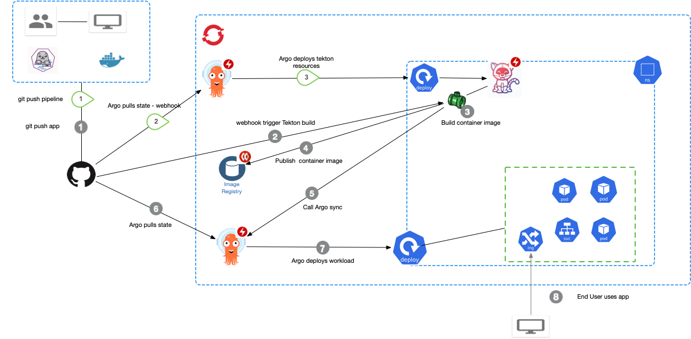

### Create a Fork of this Repo for your own fun.


1. Since you are running a GitOps Example, you want to create a fork of this repo into your own git-repo

    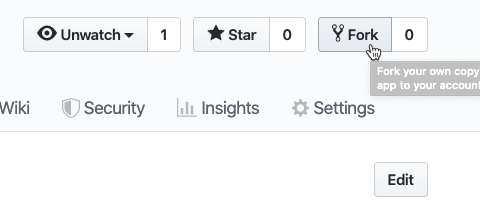

2. Select your user 

    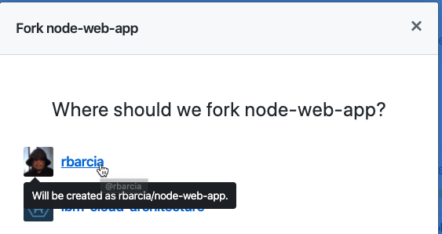

3. You want to create a Clone of your new repo
```console
 git clone https://github.com/<your-user>/node_web_app.git

 cd node_web_app
```

### Run Node App and Test Locally with Docker or Podman 

The Node Applicaiton is created following this tutorial simulating how a new user might learn to containerize a Node App.  
[Dockerizing a Node.js web app](https://nodejs.org/fr/docs/guides/nodejs-docker-webapp/)

1. To run the applicaiton locally, [Install Docker Desktop](https://www.docker.com/products/docker-desktop) or you could use [podman](https://podman.io/) on Linux (This assumes you use podman CLI instead of docker.  Substitute docker <command> with podman <command>)

2. You can run the app locally if you have [node](https://nodejs.org/en/) installed

```
npm install 
node server.js

```


3. Since you have the code, docker build


```
docker build -t <your username>/node-web-app .
```
If you want to use podman locally, follow directions [here](https://developers.redhat.com/blog/2019/09/13/develop-with-node-js-in-a-container-on-red-hat-enterprise-linux/) to build with buildah.


4. Run the applicaiton in a container.
```
docker run -p 49160:8080 -d <your username>/node-web-app

```

5. Check that the container is running.
```
docker ps
```

6. Test the Application 

```
curl -i localhost:49160

```
### Change Pipeline Resource to your git repo.

This change is required to run a build from the console without a Trigger Event.  

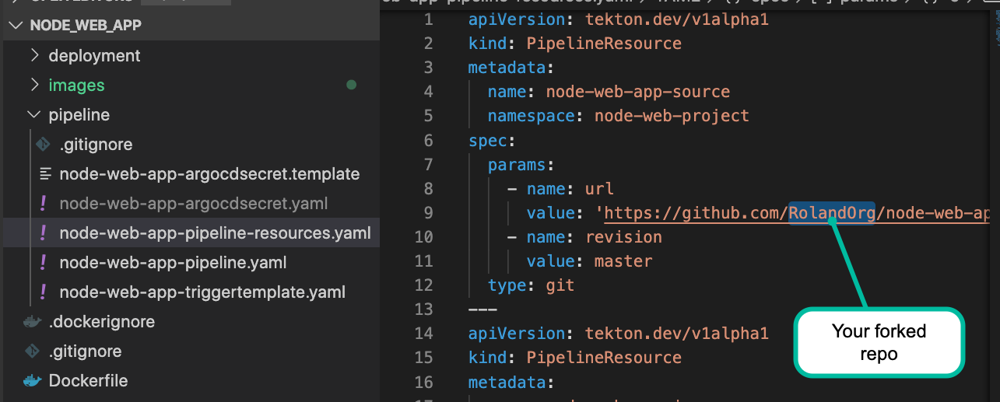

### Using OpenShift 4.3 as my Kubernetes Cluster 

You need your own 4.3 OpenShift Cluster.  Here are some options.  

I [installed OpenShift 4.3 into AWS following these instructions](https://docs.openshift.com/container-platform/4.3/installing/installing_aws/installing-aws-account.html).

You could use [Code Ready Containers](https://cloud.redhat.com/openshift/install/crc/installer-provisioned?intcmp=7013a000002CtetAAC) Locally.  

This tutorial can work also on any Kubernetes, but you have to install Tekton and use the [buildah](https://github.com/tektoncd/catalog/tree/v1beta1/buildah) task. 

### Needed CLI and log into OpenShift

You need the following CLI's 

- [kuberenetes](https://kubernetes.io/docs/tasks/tools/install-kubectl/)
- [oc](https://docs.openshift.com/container-platform/4.3/cli_reference/openshift_cli/getting-started-cli.html#installing-the-cli)
- [tkn](https://openshift.github.io/pipelines-docs/docs/0.10.5/assembly_cli-reference.html)
- [argocd](https://argoproj.github.io/argo-cd/cli_installation/)


[Log into your OpenShift Cluster](https://docs.openshift.com/container-platform/4.3/cli_reference/openshift_cli/getting-started-cli.html#cli-logging-in_cli-developer-commands) should automatically log you into kubernetes and tekton.  

```
oc login --server=https://<OCP API Server>  --token=<Your Auth Token>
```
Your ID should use an ID with admin access since you will be installing a set of tools.  

You can also log into your OpenShift web console.  


### Install ArgoCD Operator into OpenShift 

There are a few ways to install argocd into a Kubernetes Cluster.  We used the Argo CD Operator.  

For this tutorial, I used [the Console Install](https://argocd-operator.readthedocs.io/en/latest/install/openshift/) using the Argo CD Operator on OpenShift.  

### Install OpenShift Pipeline Operator 

OpenShift delivers a preview of tekton through the OpenShift Pipeline Operator.  We used the OpenShift Pipeline Operator.  

For this tutorial I follwed the instructions to install the [OpenShift Pipeline Operator](https://openshift.github.io/pipelines-docs/docs/0.10.5/assembly_installing-pipelines.html).

### Install the Argo CD Tekton Task into the argocd namespace

After tekton builds the application and pushed the container image into the Image Repository, tekton needs to trigger a new OpenShift Deployment.  There is a special task that allows Tekton to trigger a argocd sync.  You have to install the [Argo CD Tekton Task](https://github.com/tektoncd/catalog/tree/v1beta1/argocd)

### Create OCP Project 
You need to create an OpenShift project called node-web-project or you will need to change all namespaces in the YAML File to match your project 

```
oc new-project node-web-project
```

### Allow Pipeline to access registry for build and deploy
Your project will need the ability to publish and pull from the image repository.  

```
oc policy add-role-to-user registry-editor builder

oc policy add-role-to-user registry-editor deployer
```

### Update argocd secret.

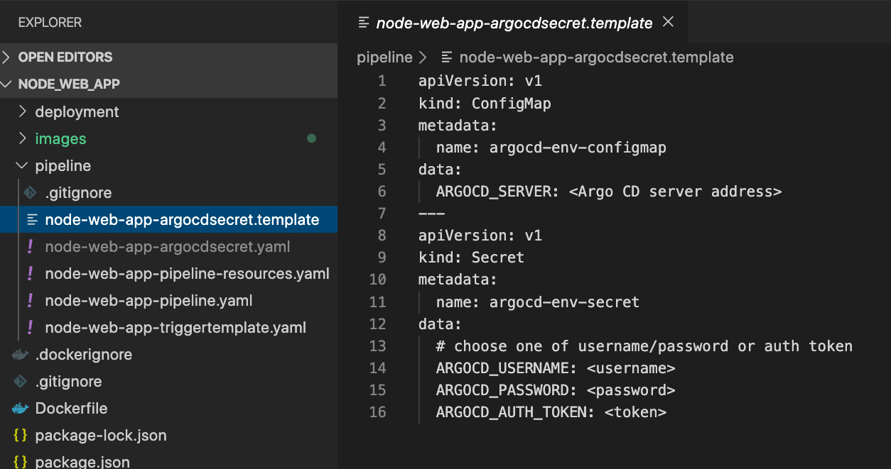

There is a file caled node-web-app-argocdsecret.template.  Create a copy of that file as yaml.

```
cd pipeline
cp node-web-app-argocdsecret.template  node-web-app-argocdsecret.yaml
```
CAUTION !!!!! the .gitigonore file contains the name of this yaml file to avoid checkin of your credentials.  If you use another name, then you must make sure you DO NOT CHECKIN credentials.  

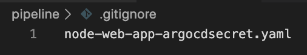

In the newly created file, replace the value for ARGOCD_SERVER to your server.  Either enter your ARGOCD_AUTH_TOKEN or User and Password Base 64 encoded.  


### Examime Pipeline YAML

Examine the Tekton Files.  A Quick summary of Tekton Resources can be read [here](https://openshift.github.io/pipelines-docs/docs/0.10.5/con_pipelines-concepts.html).  You already saw one of the YAML files to configure the secret. 

[node-web-app-pipeline-resources.yaml](pipeline/node-web-app-pipeline-resources.yaml): [Pipeline Resources](https://github.com/tektoncd/pipeline/blob/master/docs/resources.md) configured for the pipeline.  There are 2, the name of the git repository and the name of the Container Image using the Internal Red Hat Registry.  Note, the resources here allow us to do a Pipeline Run fomr the console or oc commandline.  It hard codes default values.  They will be overridden by Trigger Template when builds are done via a git push.  

[node-web-app-pipeline.yaml](pipeline/node-web-app-pipeline.yaml): Our [Pipeline](https://github.com/tektoncd/pipeline/blob/master/docs/pipelines.md) for building, publishng, and deploying our Node App.  There are 2 [Tasks](https://github.com/tektoncd/pipeline/blob/master/docs/tasks.md).  We make use of some default tasks rather than creating our own.  A real life pipeline will execute tests, tag images, and so forth.  Tasks:

- the build-and-publish-image uses the ClusterTask buildah (podman build system).  
- argocd-sync-deployment uses the argocd Task we installed earlier

[node-web-app-triggertemplate.yaml](pipeline/node-web-app-triggertemplate.yaml):  Now that the pipeline is setup, there are several resources created in this file.  They create the needed resources for triggering builds from an external source, in our case a Git webhook.  [You can learn more about Tekton Triggers here](https://github.com/tektoncd/triggers).  We have created the following.  

- A TriggerTemplate is used to create a template of the same pipeline resources, but dynamically genertaed to not hard code image name or source.  It also creates a PipelineRun Template that will be created when a build is triggered. 

- A TriggerBining that binds the incoming event data to the template (this will populte things like git repo name, revision,etc....)

- An EventListener that will create a pod application bringing together a binding and a template.  

- An OpenShift Route to expose the Event Listener.  Your will create a GIT Webhook that will callback this Route.  

You can learn about [Tekton Resources](https://github.com/tektoncd/pipeline/tree/master/docs#learn-more) and [OpenShift Pipleines](https://openshift.github.io/pipelines-docs/docs/0.10.5/con_pipelines-concepts.html)


### Create and configure ArgoCD App for Tekton Resources 

We can use argocd to deploy the tekton build for the app.  IN a real project, having your pipeline in a separate repo might be better.  [You can create an argo cd app via the GUI or commandline](https://argoproj.github.io/argo-cd/getting_started/).   

The screenshot below shows the parameters I entered.  You need to use your own forked git repo.  

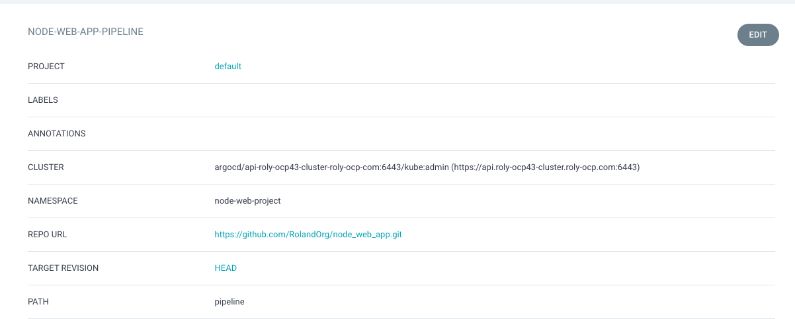 

- Project: default
- cluster: (URL Of your OpenShift Cluster)
- namespace should be the name of your OpenShift Project
- Targer Revision: Head
- PATH: pipeline
- AutoSync Enabled.  

Once you run sync, your pipeline should be deployed and your screen in argo should look like below.  

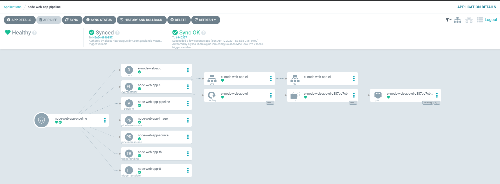

### Run a Build

At this point you can run a build.  The Build Should succeed, but the deploy should fail.  If you configure the deployment first however, deloyment will fail to start because the image has not been published.  

1. You can go into the Pipelines section of the OpenShift Console, right click the pipeline and click Start.

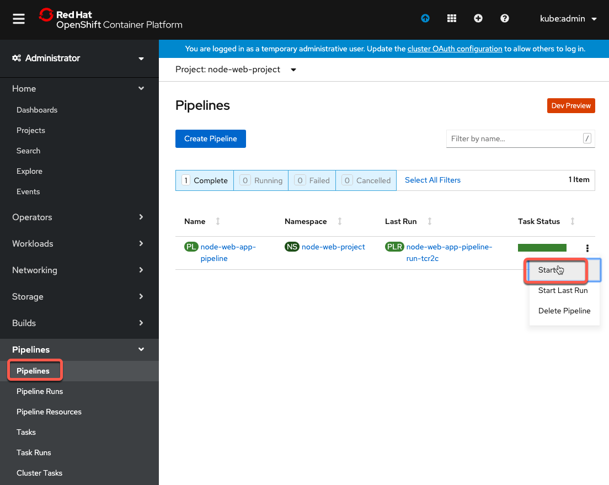

2. You will see that the values are prepopulated with default PipelineResources as shown below.  


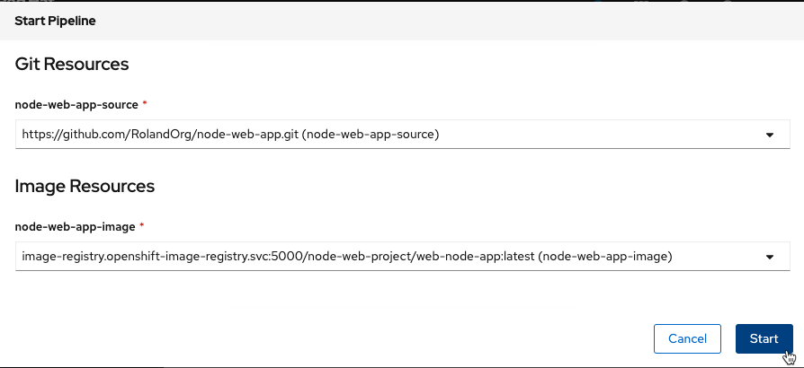

3. The pipeline should run, the build should pass (Creates the Container Image and publishes it to the Container Registry).  The argo-cd sync should fail because we have not configured the argod app for deploying the node-web-project.  


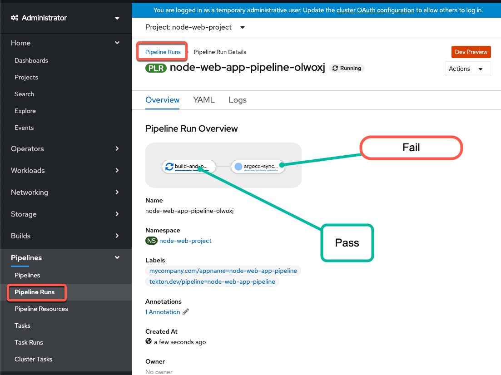


### Examine Application 

Let's look at the OpenShift Configuration for our node application.

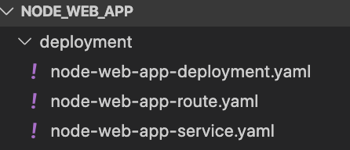

- [node-web-app-deployment.yaml](deployment/node-web-app-deployment.yaml) - This represents our Kubernetes Deployment. 

- [node-web-app-service.yaml](deployment/node-web-app-service.yaml):  This expose the node app to the cluster.

- [node-web-app-route.yaml](deployment/node-web-app-route.yaml): Exposes an OpenShift Route so you can access Node App from outside the cluster


### Create ArgoCD App for Web App Resources 

Just like we used argocd to deploy the tekton pipeline, you will create another argocd app that corresponds to the deployment.   [You can create an argo cd app via the GUI or commandline](https://argoproj.github.io/argo-cd/getting_started/).   

The screenshot below shows the parameters I entered.  You need to use your own forked git repo.  

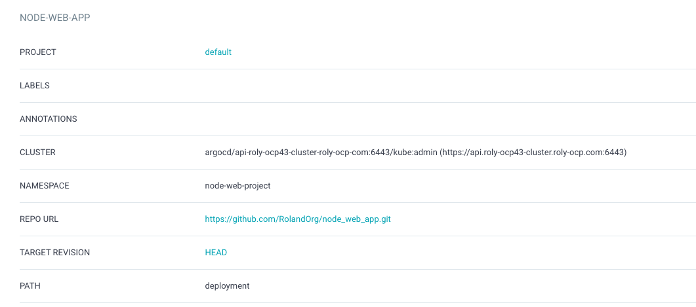

- Project: default
- cluster: (URL Of your OpenShift Cluster)
- namespace should be the name of your OpenShift Project
- repo url: should be your forked git repo.  
- Targer Revision: Head
- PATH: deployment
- AutoSync Disabled.  


### Sync Repo 
From here, you can trigger a sync manually by clicking sync.  Once your resources are deployed, your build from earlier is complete.  The screen should look like the figure below.  

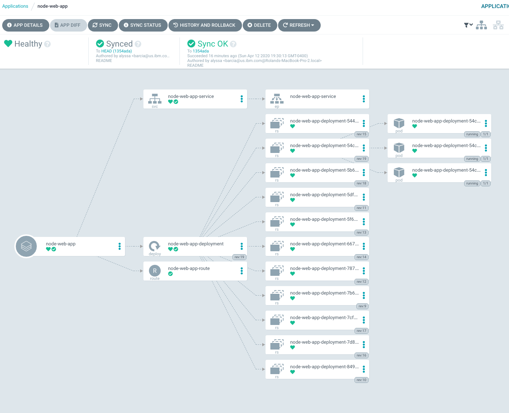


### Run Pipeline 

1. You can go into the Pipelines section of the OpenShift Console, right click the pipeline and click Start.


2. You will see that the values are prepopulated with default PipelineResources as shown below.  


3. The pipeline should run, should now complete.  

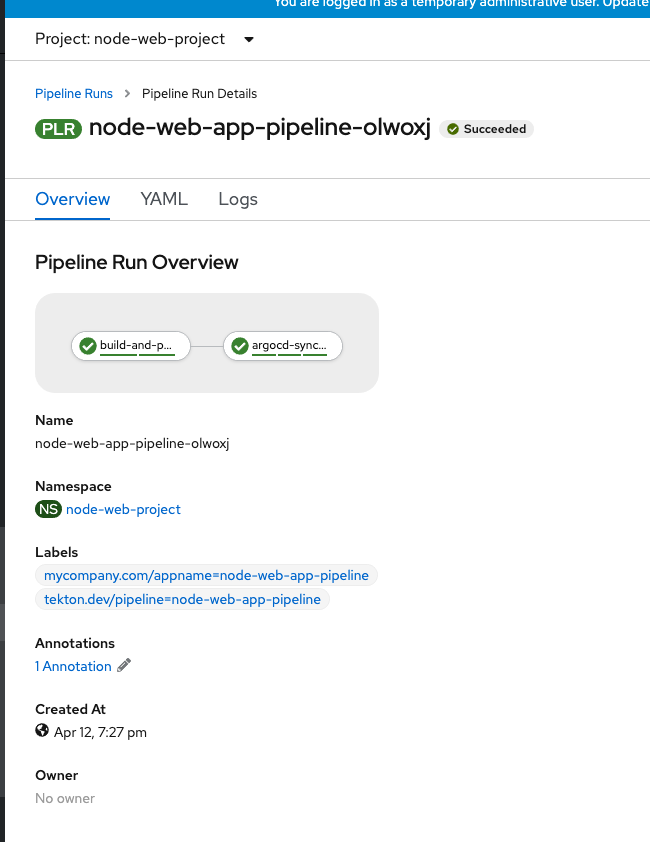


### Configure Webhooks 

You will now need to configure 2 WebHooks.  

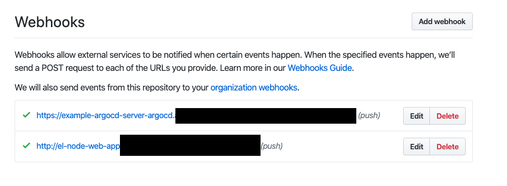

1. One WebHook will be configured to our argocd pipeline app.  This will enabled you to push changes to your pipeline plus for argocd to detect changes for your app (though autosync is not on)

    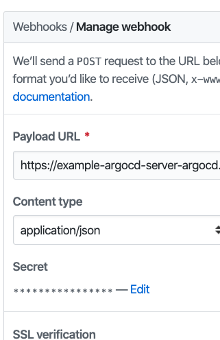


2. One webhook will go to your Tekton Event Listener to start a tekton build from git push

    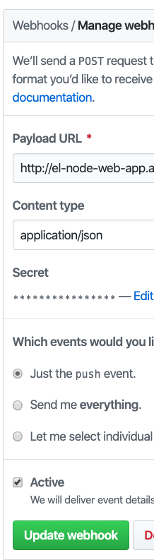

### Make a code change and commit, look at build.   


1. Make a change to the deployment YAML.

    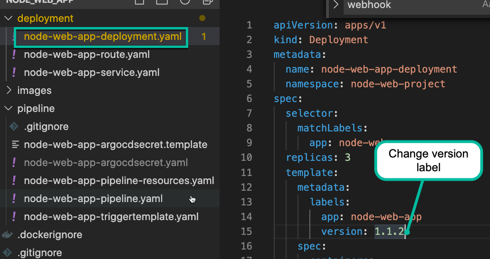

2. Make a change to the Node JS Code.  


    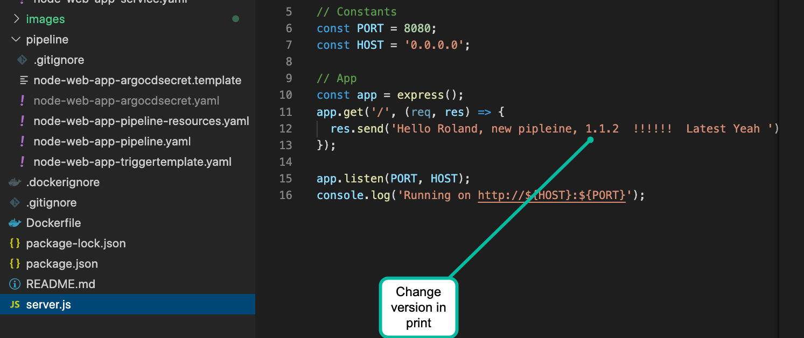

3. Push the changes to your repo

```

git add .
git commit -m "First Deployment"
git push

```

    In a real deployment, you might have many webhooks.  git push can be build to dev while a git tag can be a build for test.  


3. Go to the OpenShift Console and you should see a pipleine run kickoff.  Wait till it is complete.  Notice the name of the pipleine run matches that in the tigger template.

    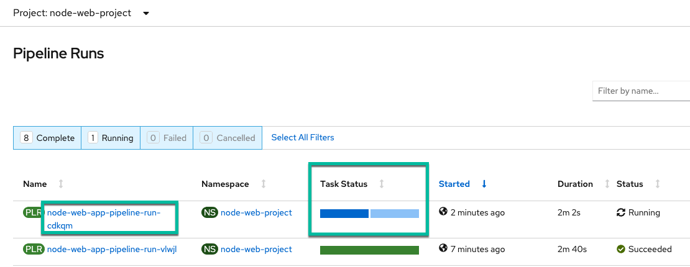

4. While waiting for the build, go to pipeline resources section and look to see new pipeline resources created for the webhook build.  It will dynamically create a resource for build so you know what parameters were used to run the build.  

    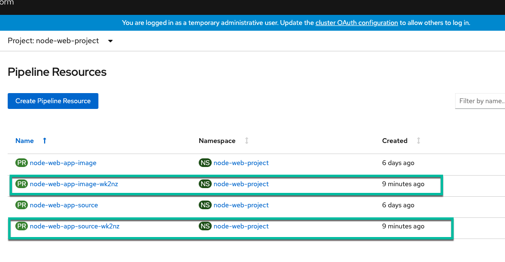


5. Go back to the Pipeline Runs and check that the build is complete.  


    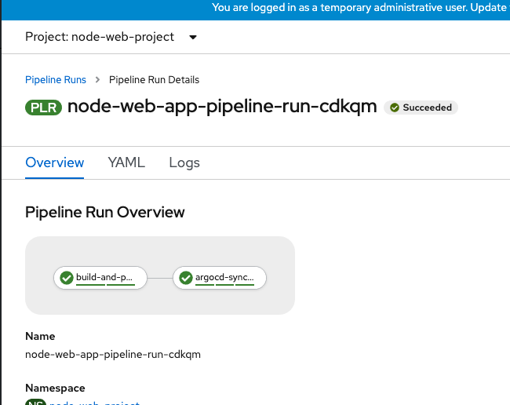


6. Go to the Topology view on the Developer Side and launch the app as shown.


    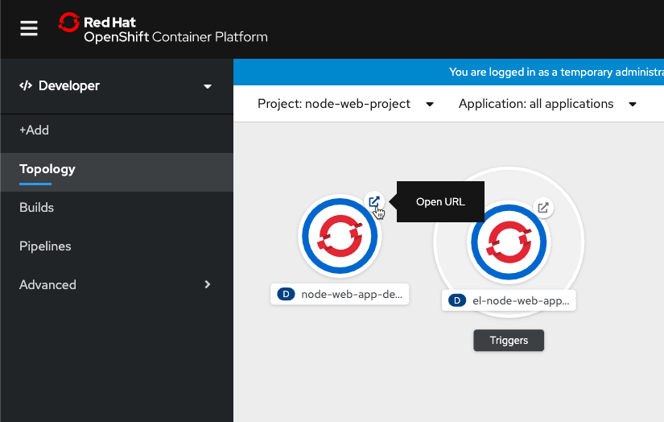


7.  If it all works out, your app should look like this


This completes loading the solution.


#### Troubleshooting

- argocd runs in an argocd namespace.  Yourtekton pipleine runs in your app namespace.  

- using tkn log <resource> intance to see tekton activity

- oc logs <resource> for various pods

- Redeploying TriggerTemplate does not cause the Event App to restart.  Delete pod to run new instance.  


